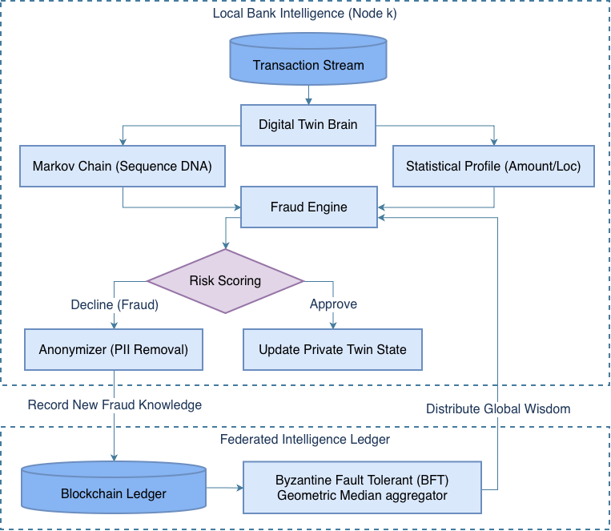
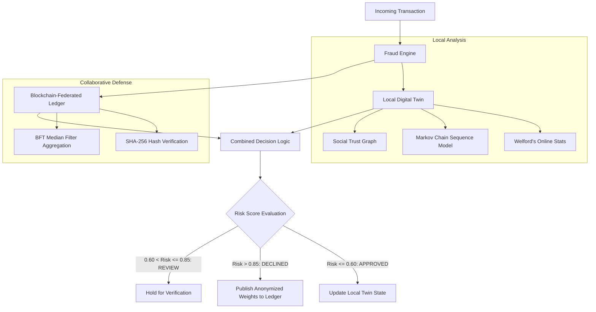
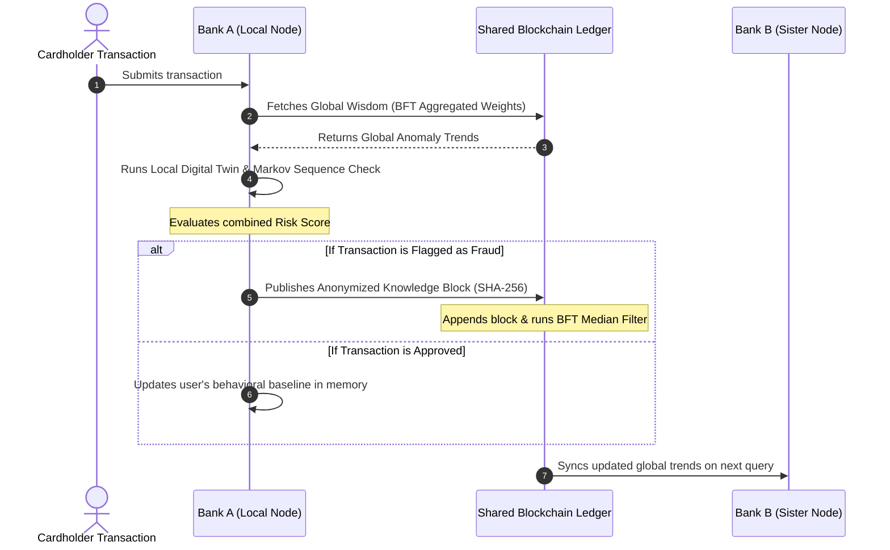

# Digital Twin & Federated Fraud Detection System 🛡️

A next-generation Credit Card Fraud Detection system that uses **Digital Twins** to model user behavior, **Markov Chains** for sequence modeling, and **Blockchain-based Federated Learning** for collaborative intelligence.

## 🌟 Key Features

### 1. The Digital Twin Model (Behavioral Identity)
Unlike traditional models that look at "Global Fraud Patterns", this system builds a unique profile for **every single user**.
- **State Tracking**: Tracks average spend, frequent locations, and merchant categories using Welford's online algorithm for variance.
- **Adaptive**: Updates in real-time with every legitimate transaction to evolve with the user's habits.

### 2. Sequence Modeling (Markov Chains)
- **Impossible Sequences**: Detects deviations in transaction flow using transition probabilities.
- **Behavioral Habits**: Identifies and validates recurring patterns (e.g., *Gas Station -> Restaurant* vs. *Gas Station -> Luxury Jewelry Store*).

### 3. Federated Learning (Blockchain Ledger)
- **Collaborative Intelligence**: Banks share anonymized behavioral model weights (e.g., high-amount trends, night-time risk) via a blockchain-simulated ledger.
- **Privacy-Preserving**: No sensitive user data (merchant names, locations) is ever shared; only abstracted risk parameters are synced.

### 4. Social Trust Network
- **Graph Analysis**: Tracks "Trusted Recipients" for transfers.
- **Risk Scoring**: Transactions to new recipients are assigned a weighted risk factor, requiring additional behavioral validation.

### 5. Interactive Dashboard
- Built with **Streamlit**.
- **Visualizes the Twin's Brain**: Real-time behavioral profiles, transition probabilities, and the federated global ledger.
- **Live Monitoring**: Simulates a transaction feed with instant decision-making.

## 📊 System Architecture & Flows

### 1. System Flowchart (High-Resolution)
Here is the operational flowchart detailing the system's transaction verification path:



*For more details, view the formal [System Architecture Design (PDF)](assets/architeture.pdf).*

### 2. Transaction Processing Logic (Interactive Flow)
This flowchart shows how an incoming transaction is evaluated locally by the individual's Digital Twin and globally against the Federated Ledger:



### 2. Privacy-Preserving Federated Learning Flow
This sequence illustrates how bank nodes share collaborative intelligence anonymously without exposing sensitive user data:



---

## 🚀 Setup & Run

### Prerequisites
- Python 3.8+

### Installation
1.  Clone/Download this folder.
2.  Install dependencies:
    ```bash
    pip install -r requirements.txt
    ```

### Usage
Run the dashboard:
```bash
streamlit run app.py
```

### How to Demo
1.  **Bootstrap**: Expand the *"Data Bootstrapping"* section in the sidebar and click **"Train Model from CSV"** to load historical data.
2.  **Train**: Click **"Generate Legit Transaction"** to see the Digital Twin learn and update its Behavioral Identity Profile.
3.  **Test**: Click **"Generate FRAUD Transaction"** to trigger the system's reaction to high amounts, impossible travel, or suspicious sequences.
4.  **Network**: Use the **"Global Sync"** controls to simulate collaborative defense by triggering attacks at a sister bank.

---

## 📂 Project Structure
- `src/`:
    - `digital_twin.py`: Core logic for state tracking, Markov Chains, and risk scoring.
    - `fraud_engine.py`: Orchestration layer for local twin and global ledger analysis.
    - `bfl_ledger.py`: Blockchain-simulated federated learning implementation.
    - `data_generator.py`: Synthetic data factory for simulation.
- `app.py`: The Streamlit Dashboard interface.
